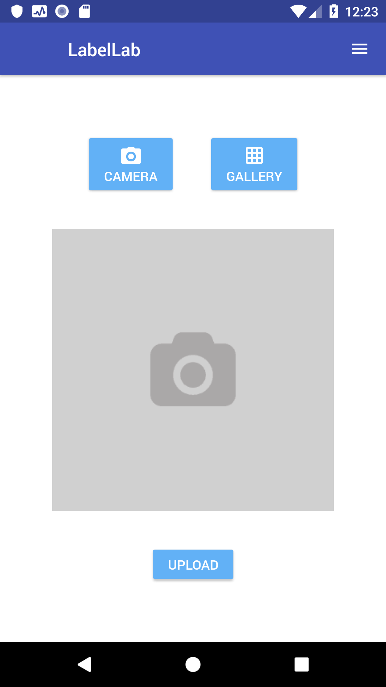
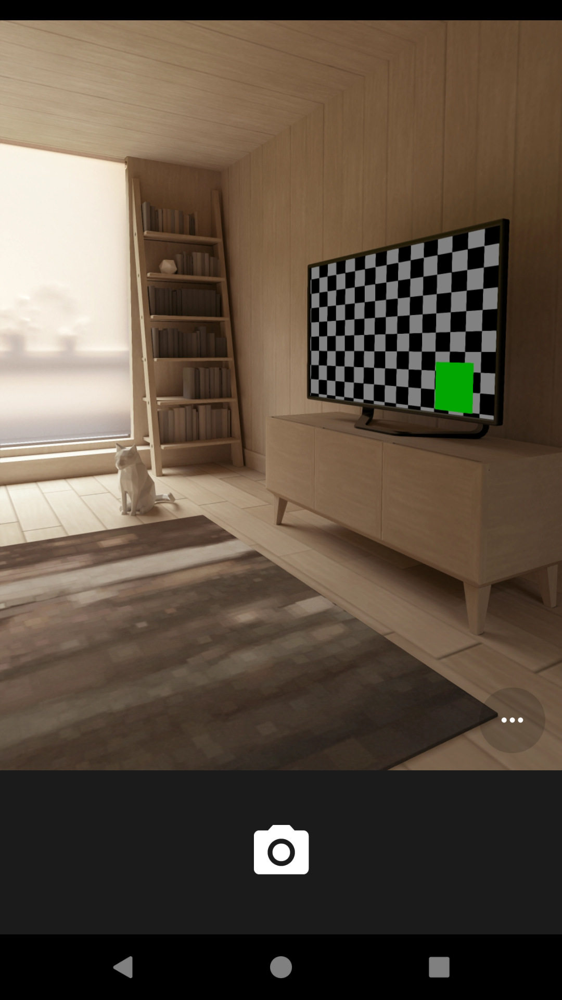
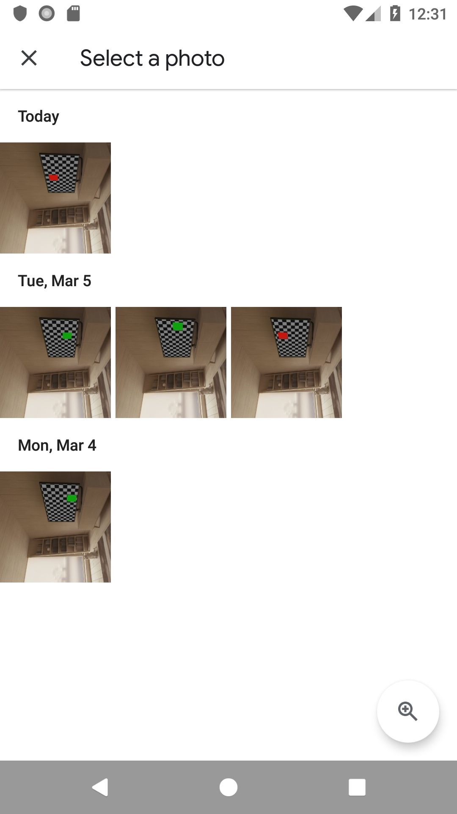
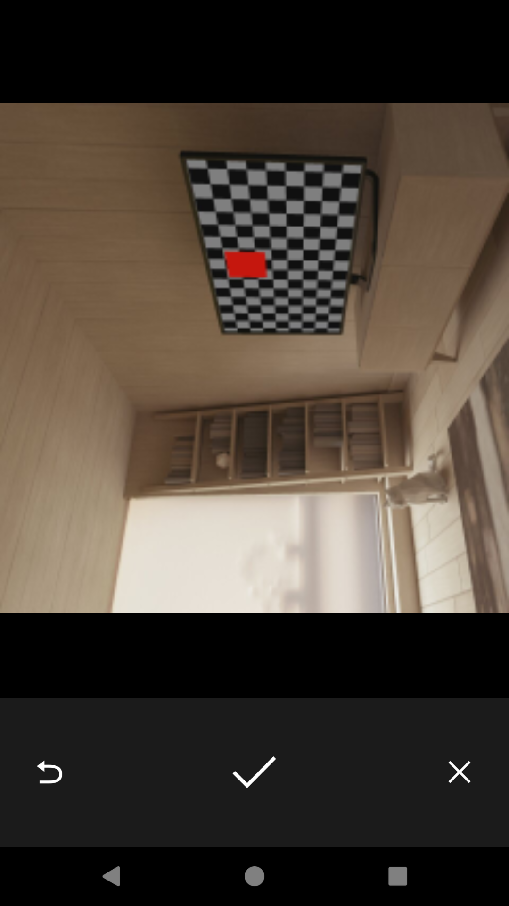
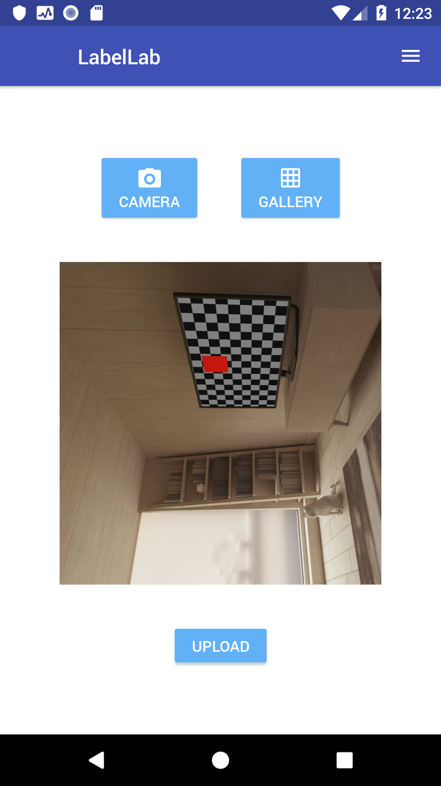
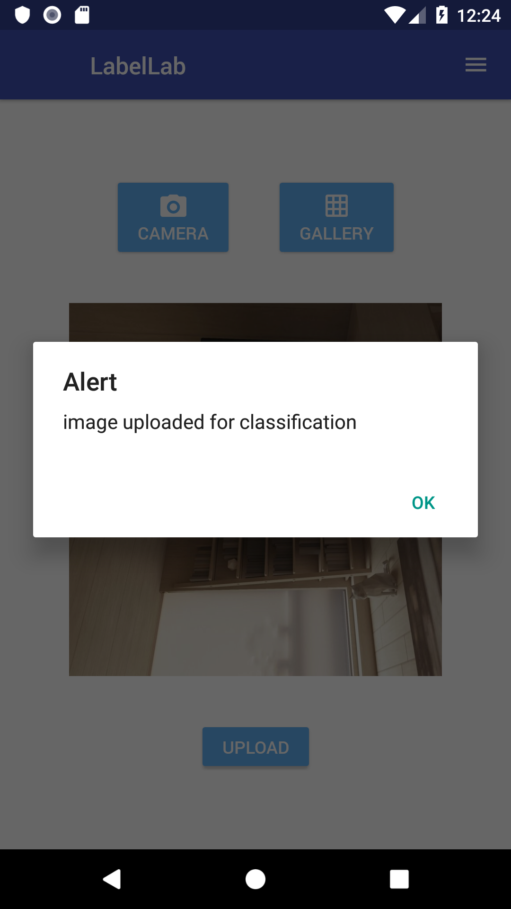
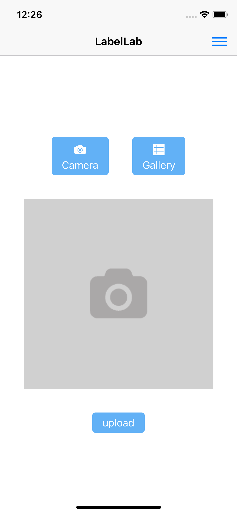
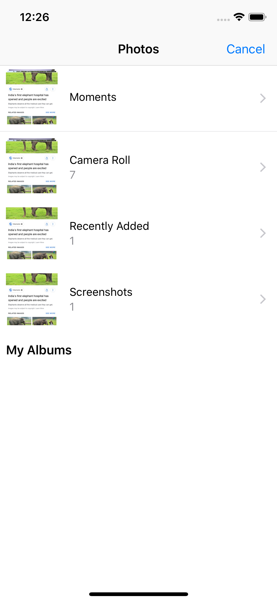
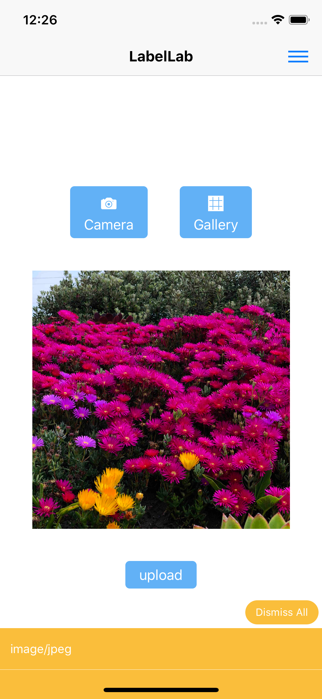
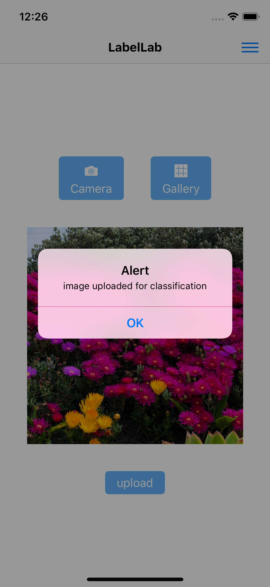

# LabelLab
Labellab is a


### Getting started
```bash
cd Mobile_App/frontend/labellab
react-native run-ios #for ios simulator
react-native run-android #for android emulator
```
### Prototype
* ***Home Page (Android)*** <br>
<br/><br/>
* ***Open Camera (Android)*** <br>
<br/><br/>
* ***Open Gallery (Android)*** <br>
<br/><br/>
* ***Click and Select Photo (Android)*** <br>
<br/><br/>
* ***Upload Photo (Android)*** <br>
<br/><br/>
* ***Upload Successful (Android)*** <br>
<br/><br/>
* ***Home Page (iOS)*** <br>
<br/><br/>
* ***Open Gallery (iOS)*** <br>
<br/><br/>
* ***Select and Upload Photo (iOS)*** <br>
<br/><br/>
* ***Upload Successful (iOS)*** <br>
<br/><br/>
